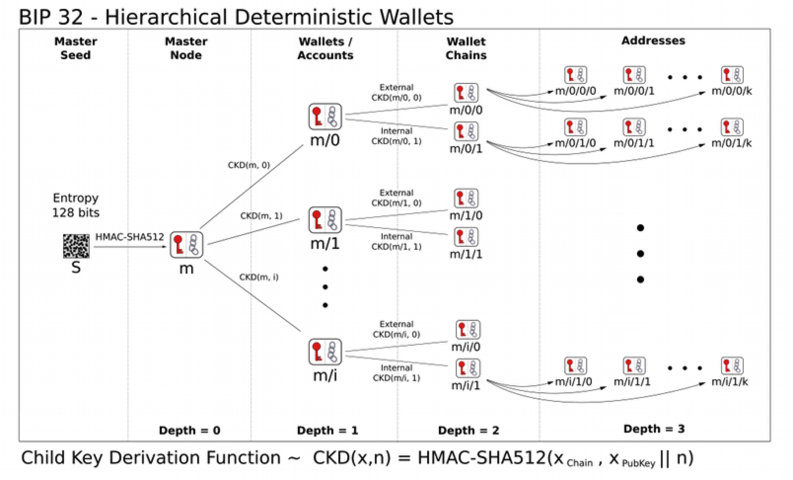

# Blockchain

### 精通比特币

Alice的钱包应用知道如何选取合适的输入匹配Alice所创建的交易金额。Alice只需要指定目标地址和金额，其余的细节钱包应用会在后台自动完成。很重要的一点是，钱包应用甚至可以在完全离线时建立交易。就像在家里写张支票， 之后放到信封发给银行一样，比特币交易建立和签名时不用连接比特币网络。只有在执行交易时才需要将交易发送到网络。也就是说**签名交易和发送交易是可以分开的**，这点很重要。

全节点，轻量级客户端

全节点客户端含有整个区块链中所有交易的所有未消费输出副本。这使得钱包既能拿这些输出构建交易，又能在收到新交易时很快地验证其输入是否正确。但是，全节点客户端占太大的硬盘空间，所以大多数钱包使用轻量级客户端，只保存用户自己的未消费输出。

如果钱包客户端没有未花费交易输出的副本，它可以使用不同的服务商提供的各种API从比特币网络中拿到这一交易信息，或者通过全节点的API调用查询这些信息。

### 密钥和地址

一个比特币钱包中包含一系列的密钥对，每个密钥对包括一个私钥和一个公钥。私钥（_k_）是一个数字，通常是随机选出的。基于私钥，我们就可以使用椭圆曲线乘法这个单向密码函数产生一个公钥（_K_）。基于公钥（_K_），我们就可以使用一个单向密码哈希函数生成比特币地址（_A_）

在比特币中使用非对称加密技术的主要原因是生成数字签名；可以将私钥用作交易的数字指纹来产生数字签名。 该签名只能由知晓私钥的人生成。 但是，任何访问公钥和交易指纹的人都可以验证签名。 这种非对称密码学的适用性使得任何人都可以验证每笔交易的每个签名，并且确保只有私钥的所有者可以生成有效的签名。

私钥：本质上是一个随机数字，这个数字非常大；比特币采取的是一个 256 bit 位的数字。_**从一个随机数生成私钥**_ 生成密钥的第一步也是最重要的一步，是要找到足够安全的熵源，即随机性来源。我们一般将 256 bit 位的私钥转成 64 位的十六进制表示


不要自己写代码来生成随机数，也不要使用编程语言提供的简易随机数生成器来获得一个随机数。使用密码学安全的伪随机数生成器（CSPRNG），并且需要有一个熵源值足够的的种子。使用随机数发生器的程序库时，需仔细研读其文档，以确保它是密码学安全的。正确实施CSPRNG是密钥安全性的关键所在

比特币私钥空间的大小是2^256，这是一个非常大的数字。用十进制表示的话，大约是10^77，而可见宇宙被估计只含有10^80个原子。



椭圆曲线乘法是密码学家称之为“陷阱门”的一种函数：在一个方向（乘法）很容易计算，而在相反的方向（除法）是不可能计算出来的。私钥的所有者可以容易地创建公钥，然后与世界共享，知道没有人可以从公钥反转该函数计算出私钥。 这个数学技巧成为证明比特币资金所有权不可伪造和安全的数字签名的基础。


比特币的公钥是通过 ECC 计算出来的，这是不可逆转的过程：_K = k \* G_ 。其中 _k_ 是私钥，_G_ 是被称为_生成点_的常数点，而 _K_ 是所得公钥。其反向运算，被称为“寻找离散对数”——已知公钥K来求出私钥_k_——是非常困难的，就像去尝试所有可能的_k_值，即暴力搜索。

比特币使用了secp256k1标准所定义的一种特殊的椭圆曲线和一系列数学常数。

### 交易

### 分叉：[软分叉和硬分叉分析](https://www.8btc.com/article/105773)

> 1. **升级过的节点接受没有升级的节点生产的交易和区块（向后兼容）**
> 2. **没有升级的节点接受升级过的节点生产的交易和区块（向前兼容）**

软分叉和硬分叉都**是指修改了比特币交易数据结构，或修改了比特币区块数据结构。不同点是软分叉需要做到向前兼容，而硬分叉只需要做到向后兼容。**

### 数字货币钱包

* [x] [HD 钱包](https://stevenocean.github.io/2018/09/23/generate-hd-wallet-by-bip39.html)
* [x] 冷钱包和热钱包

学习钱包需要了解一些钱包的规范

1. [**BIP-39**](https://github.com/bitcoin/bips/blob/master/bip-0039.mediawiki): 助记词
2. [**BIP-32**](https://github.com/bitcoin/bips/blob/master/bip-0033.mediawiki)：HD 钱包
3. [**BIP-43**](https://github.com/bitcoin/bips/blob/master/bip-0043.mediawiki)：多用途 HD 钱包结构
4. [**BIP-44**](https://github.com/bitcoin/bips/blob/master/bip-0044.mediawiki)：多币种和多账户钱包

其他规范参考：[BitCoin bips](https://github.com/bitcoin/bips)

#### BIP 32

#### 助记词

* [BIP39 比特币的助记词表](https://github.com/bitcoin/bips/tree/master/bip-0039)

#### 隔离见证

* [https://www.chainnews.com/articles/311102570532.htm](https://www.chainnews.com/articles/311102570532.htm)
* [精通比特币里对隔离见证的解释](https://wizardforcel.gitbooks.io/masterbitcoin2cn/content/appdx4.html)

### 资料

更多关于钱包的资料

* [精通比特币里的钱包](https://github.com/tianmingyun/MasterBitcoin2CN/blob/master/ch05.md)
* [BIP32 协议解读](https://www.jianshu.com/p/941de6013a64)

